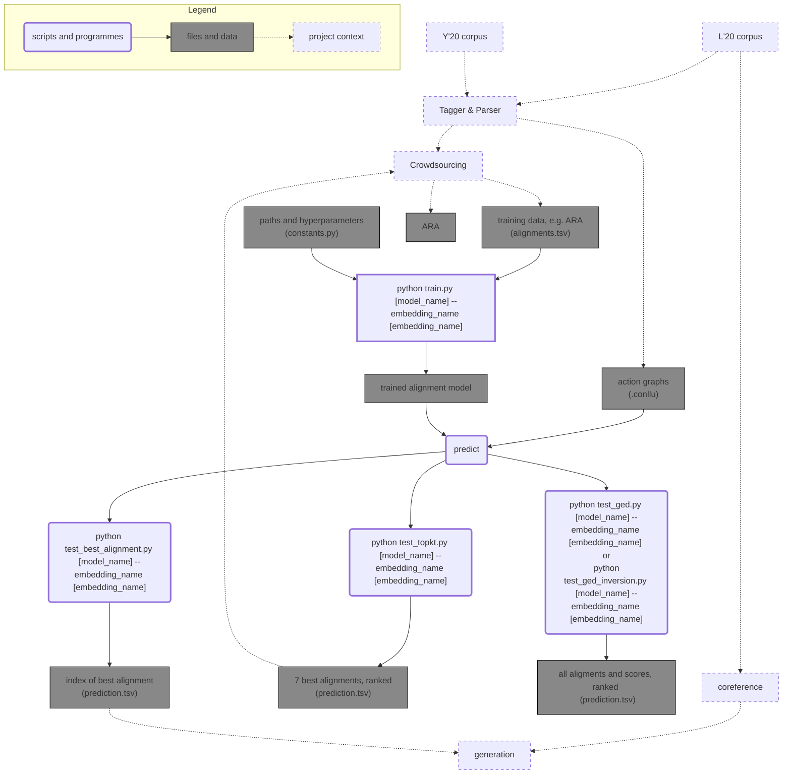

# Automatic Alignment Model
In this repo we present the new release of our Automatic Alignment Model 2.0. The version 1.0 has been presented in our paper **"Aligning Actions Across Recipe Graphs"**, where we compared two automatic alignment models (base, extended) and a simple baseline (cosine similarity). You can find this previous release [here](https://github.com/interactive-cookbook/alignment-models/releases/tag/v1.1.0).

In this new version, we enlarge the functionalities of the alignment model since we make available the possibility of testing it on different functionalities.
Its applications can be regrouped under three major outputs:

Functionality | Output
--- | ---
*Best local alignment* |Alignment to the best action only, [original version](https://github.com/interactive-cookbook/alignment-models/releases/tag/v1.1.0).
*Top k best alignments* | Top k best alignments
*All alignments and their scores for Graph Edit Distance (GED)* | All possible alignments and their corresponding alignment scores, ranked from the best to the worst.

## Requirements
You can find all the requirements in the file `requirement.txt`. Please call `requirement.txt --no-deps` when you install the requirements.
- Python 3.7
- Conllu 4.2.2
- Matplotlib 3.3.2
- Pandas 1.2.3
- Pytorch 1.7.1
- Transformers 4.0.0
- Flair 0.8.0.post1
- AllenNLP 0.9.0

## Usage

This flow-chart shows the scripts and data associated with this repo as well as how this repo is related to the other parts of the cookbook project.

To ensure a cross validation, we train the model for 10 folds, with 70 epochs each. To start the cross validation, run:

`./cross_valid_alignment_model`

This script can be changed according to which version of the test script of the model we want to use. They are displayed in detail in the following.

### Training

Download the corpus from [here](https://github.com/interactive-cookbook/alignment-models/tree/main/data) into `./alignment-models/data/` folder for reproducing our experiment results. The data should be structured in one directory (/data), containing subdirectories corresponding to the different dishes, each of them including the recipes of the dish regrouped under a /recipes directory, and an "alignments.tsv" file. This file shows the crowsourced golden standard alignments of the correspoding recipes, but it is required only for training purposes.

Additionally, create the results folder where the trained models and their test results will be saved (**Notes:** You can change the hyperparameters and the path names in the file `constants.py`). Per default, the script looks for the following results folders:

Model Name | Saves To
--- | ---
Alignment Model (extended) | `./results1`
Alignment Model (base) | `./results2`
Cosine Similarity Baseline | `./results3`
Naive Model | `./results4`

To train the model, run the following command from this directory:

`python train.py [model_name] --embedding_name [embedding_name]`

where `[model_name]` could be one of the following:
- `Sequence` : Sequential Ordering of Alignments
- `Cosine_similarity` : Cosine model (Baseline)
- `Naive` :  Common Action Pair Heuristics mode (Naive Model)
- `Alignment-no-feature` : Base Alignment model (w/o parent+child nodes)
- `Alignment-with-feature` : Extended Alignment model (with parent+child nodes)

and `[embedding_name]` could be one of the following:
- `bert` : BERT embeddings (default)
- `elmo` : ELMO embeddings

To test the model, choose the application from the following:

### Best local alignment

Run the following command from this directory:

`python test_best_alignment.py [model_name] --embedding_name [embedding_name]`

As output, a prediction file named after the test dish(es) will be created. Here the best alignment computed for each action of the test recipes is saved.

### Top k best alignments

Run the following command from this directory:

`python test_topkt.py [model_name] --embedding_name [embedding_name]`

As output, a prediction file named after the test dish(es) will be created. Here the k (k=value set as a constant, we use k=7 for our crowdsourcing purposes) best alignments computed for each action of the test recipes are saved as ranked from the best one to the worst one.
This top k functionality is used for our [crowdsourcing experiment](https://github.com/interactive-cookbook/crowdsourcing) to help the participants focus only on the most probable alignments.

### All alignments and their scores for Graph Edit Distance (GED)

Run the following command from this directory:

`python test_ged.py [model_name] --embedding_name [embedding_name]`

As output, a prediction file named after the test dish(es) will be created. Here all alignments computed for each action of the test recipes are saved as ranked from the best one to the worst one. Their corresponding alignment scores are also listed in this file.
We use the results of this model functionality to compute [graph alignment](https://github.com/interactive-cookbook/graph-alignment) between recipes. In order to do it, we compute the graph edit distance between recipes or action graphs. We use the alignment scores of the prediction file as operation costs that can be performed in GED between two graphs to calculate their (dis)similarity. For deletion costs, we use the model's results directly by retrieving the actions and their scores that correspond to null alignments. For substitution and insertion costs, a different test script should be used. Please run:

`python test_ged_inversion.py [model_name] --embedding_name [embedding_name]`

As output, the same file format as in `test_ged.py` output is expected, but the alignment direction is swapped among the graph pair. `test_ged.py` aligns graph1 to graph2, `test_ged_inversion.py` aligns recipe2 to recipe1. For insertion costs, we use the `test_ged_inversion.py` results directly by retrieving the actions and their scores that correspond to null alignments. For substitution costs, we calculate the average between scores corresponding to the same action pair in both `test_ged.py` and `test_ged_inversion.py` results.

## Evaluation

To evaluate the results obtained by each version of the test script of the alignment model, create a directory (e.g., ([predictions](https://github.com/interactive-cookbook/alignment-models/tree/main/predictions)) where you store the prediction file of the dish that you want to evaluate. Create a directory called ["test"](https://github.com/interactive-cookbook/alignment-models/tree/main/test) where you store the data (recipes and alignment file) related to the dish stored in "predictions". Then run:

`python evaluate_predictions.py [predictions]`

## Results (to update)

Our experiment results are as follows:

| Model Name | Accuracy |
| ---------- | :---: |
|Sequential Order | 16.5 |
|Cosine Similarity | 41.5 |
|Naive Model | 52.1 |
| Alignment Model (base) | 66.3 |
| Alignment Model (extended) | **72.4** |

Both the base and the extended Alignment models were trained for 10 folds each with 40 epochs.

